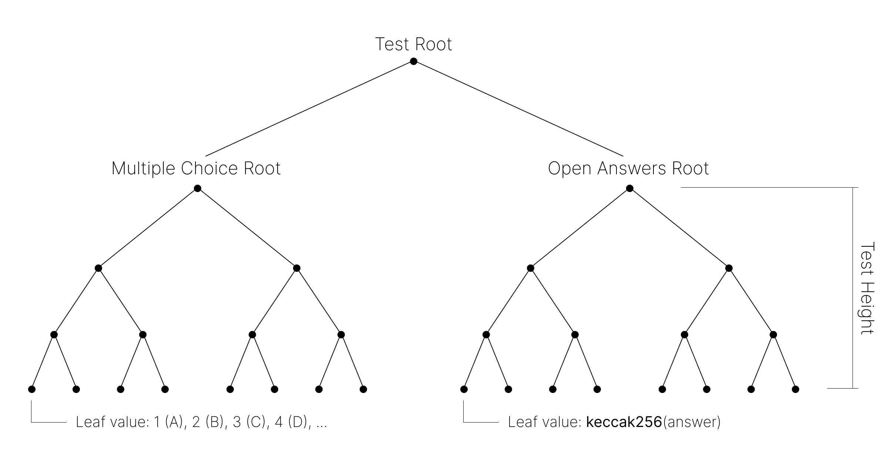

# Block Qualified Tests

The `Test` object is at the core of the protocol: it defines the credential and what is needed to obtain it.

Each test contains two distinct components, each forming a Merkle tree formed with the SNARK-friendly [Poseidon](https://www.poseidon-hash.info/) hash function:

  

- A **multiple choice** component, where the answer to each question is part of a given finite set. The resulting Merkle root is named `multipleChoiceRoot`. The grade for this component is only awarded if the user gets all the answers right: if they know a tree with `multipleChoiceRoot` at its root.
- An **open answer** component, where the answer to each question can be any value. The leaves of the tree are the [keccak256](../../packages/lib/src/helpers/hash.ts) hashes of the answers, made compatible with the SNARK scalar modulus. The resulting Merkle root of the correct answers is named `openAnswersHashesRoot`. The grade for this component is awarded incrementally per answer that the user gets right: every matched hash with the correct `openAnswerHashes`, with the preimage being the users' answer.

The `TREE_HEIGHT` constant determines the maximum number of questions possible for each component. This value is set to 6, giving us a maximum of 64 questions per component. 

If the credential issuer does not define all of the questions, its recommended that each tree gets padded to 64 with the default value: `0` for multiple choice questions, and `keccak256("")` for open answer questions. The value of the `testRoot` is used to define and identify the test. 

The final grade of a test is calculated as the weighted sum of these two components, using the following formula:

$$
  \textrm{grade} = \textrm{result} \cdot \texttt{multipleChoiceWeight} + \\[7pt] + \max((\texttt{nCorrect} + \texttt{nQuestions} - \texttt{maxQuestions}) \cdot \frac{100 - \texttt{multipleChoiceWeight}}{\texttt{nQuestions}}, 0)
$$

Where:
- `result` is either 1 or 0, depending on whether the user solved the multiple choice component or not, respectively.
- `multipleChoiceWeight` is the percentage of the multiple choice part towards the final grade.
- `nCorrect` is the number of correct open answers the user got, including to non-defined questions whose answer is `keccak256("")`.
- `nQuestions` is the number of open answer questions that make up the test.
- `maxQuestions` is the maximum number of open answer questions the implementation supports, in this case 64.


Because of the formula above, `nQuestions` must always be greater than one.

For tests that only contain a multiple choice component, `multipleChoiceWeight` must be set to 100, while `nQuestions` must be set to 1; for tests that only contain an open answer component, `multipleChoiceWeight` must be set to 0.



Inside of the circuit, we compute the value for [`grade ⋅ nQuestions`](../../packages/circuits/circuits/lib/get_grade.circom) to avoid non-quadratic constraints. This is the value that is later commited to the grade group, alongside the user's identity secret. 


When the user's grade is over a defined `minimumGrade`, they have gained the credentials, and their identity commitment gets added to the credentials group. Otherwise, their identity commitment gets added to the no-credentials group. These parameters that define the criteria to pass a test get encoded into the variable `testParameters`:

$$
  \texttt{testParameters} = \textrm{Poseidon}(\texttt{minimumGrade}, \texttt{multipleChoiceWeight}, \texttt{nQuestions})
$$