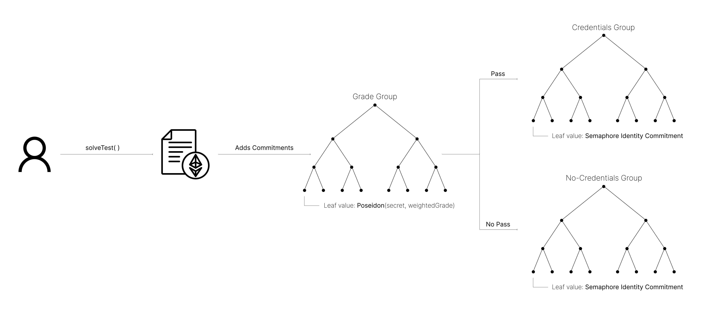

# Block Qualified Contracts

The smart contracts for Block Qualified serve to verify the proofs generated by the circuits and integrate within Semaphore to add an additional privacy layer.

## Credentials.sol

The main smart contract for Block Qualified, [Credentials.sol](../../packages/contracts/contracts/base/Credentials.sol) allows users to create, manage and solve tests.

### Creating a Test

Anyone can create a new Block Qualified Test by calling the `createTest` function inside the smart contract, and providing:
- `minimumGrade`: out of 100, minimum total grade the user must get to obtain the credential.
- `multipleChoiceWeight`: out of 100, contribution of the multiple choice component towards the total grade.
- `nQuestions`: number of open answer questions the test has, up to a maximum of 64 -- must be set to 1 for pure multiple choice tests.
- `timeLimit`: unix time limit after which it is not possible to obtain this credential -- must set 0 for unlimited.
- `admin`: address that will control the credential.
- `multipleChoiceRoot`: root of the correct multiple choice Merkle tree, where each leaf is the correct choice out of the given ones, as covered in [Block Qualified Tests](block-qualified-tests.md).
- `openAnswersHashesRoot`: root of the correct open answers Merkle tree, where each leaf is the hash of the corresponding correct answer, as covered in [Block Qualified Tests](block-qualified-tests.md).
- `testURI`: external resource containing the actual test and more information about the credential.

The resulting test is given a unique `testId`. The function will then compute and store the `testRoot` and `testParameters` as specified in [Block Qualified Tests](block-qualified-tests.md), and define three new on-chain groups:

- The grade Semaphore-like group, that will contain all the grade commitments for every solving attempt, and whose `groupId = 3 ⋅ testId`.
- The credentials Semaphore group, that will contain all the identity commitments of the users that obtain the credential, and whose `groupId = 3 ⋅ testId + 1`.
- The no-credentials Semaphore group, that will contain all the identity commitments of the users that do not obtain the credential, and whose `groupId = 3 ⋅ testId + 2`.


Although these three groups are all given different `groupId`s, they are all constructed using the same `zeroLeaf` for gas saving purposes:

$$
    \texttt{zeroLeaf} = \textrm{keccak256}(\texttt{testId}) >> 8
$$


### Solving a Test
To obtain a credential, the user must call the `solveTest` function, providing a valid proof for the [Test circuit](circuits.md#the-test-circuit) that verifies their proof of knowledge of their solution. The user must specify in the `testPassed` boolean parameter for this function if their solution achieves a grade over `minimumGrade` or not.

The way this is enforced is by setting the `testParameters` public signal of the proof: 
- If the user sets `testPassed` to **true**, the public input `testParameters` set when verifying the proof will make it **invalid** if the grade obtained is below `minimumGrade`.
- If the user sets `testPassed` to **false**, the public input `testParamters` will set the `minimumGrade` to 0, so the grade check inside the proof will clear.


This means that a user can potentially provide a passing solution and still decide to add themselves to the no-credentials group.


Depending on the value for `testPassed`, the user will get their Semaphore identity commitment added to the credentials group or to the no-credentials group, respectively. Their grade commitment will be added to the grade group either way.

  

The height of these three trees is set by the `N_LEVELS` parameter, fixed at 16. This gives us a maximum of 65536 leaves.

### Verify a Test
The admin of a test can choose to _verify it_ by providing the open answer hashes needed to solve this test directly on-chain, which is done by calling the function `verifyTest`.

### Invalidate a Test
The admin of a test can choose to invalidate it, so that users can no longer attempt to solve it, by calling the function `invalidateTest`.

### Update a Test's Admin
The admin of a test can choose to transfer admin rights to a different address by calling the function `updateTestAdmin`.